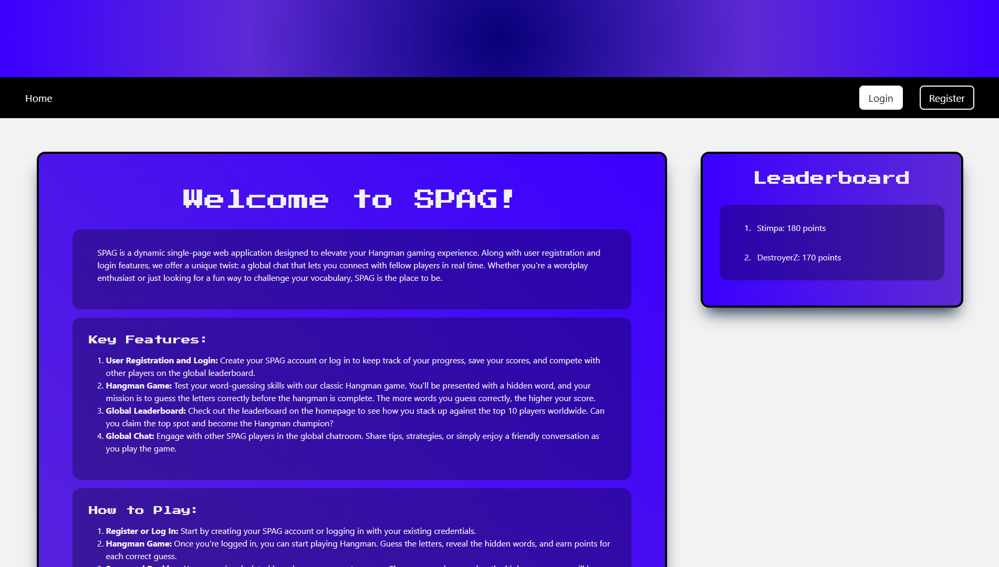
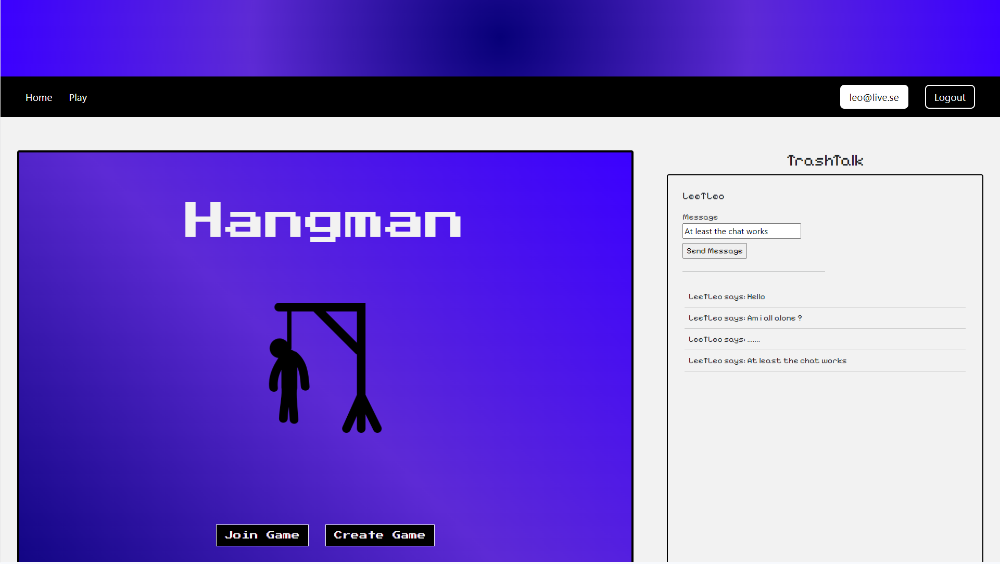

# SPA-Game-Project

## Team members
<a href = "https://github.com/lordstimpa/SPA-Game-Project/graphs/contributors">
  
</a>

[Steven Dalfall](https://www.github.com/lordstimpa) | [Leo Stålenhag](https://www.github.com/L-stal) 

## Overview

This project was made using ASP.NET Core with React and Identity authentication. We are also using SignalR for real-time updates in various functionality such as our global chat and in our game logic.

As a user, you are able to register an account and chat with all of the users in our global chat while playing "Hangman" which is a word-guessing game.

Each user that performs well will be displayed on the global top 10 leaderboard which is viewable on the homepage. You are also able to see more personal stats in your personal profile.

## Code

We have created a lot of API endpoints and SignalR hubs for setting up a great gaming environment for each user. This was crucial for making the chat and game work well together.

### This is our API end-point for starting a game session:

```
[HttpPost("startgame")]
public GameViewModel StartGame()
{
    string publicId = Guid.NewGuid().ToString();
    string hiddenAnswer = "";
    string userId = User.FindFirst(ClaimTypes.NameIdentifier)?.Value;

    string filePath = Path.Combine(_hostingEnvironment.ContentRootPath, "Data", "GameTitles.json");

    if (System.IO.File.Exists(filePath))
    {
        string jsonData = System.IO.File.ReadAllText(filePath);
        var answersList = Newtonsoft.Json.JsonConvert.DeserializeObject<AnswerModel>(jsonData);

        if (answersList != null && answersList.Answers != null && answersList.Answers.Count > 0)
        {
            int randomIndex = new Random().Next(answersList.Answers.Count);

            string answer = answersList.Answers[randomIndex];
            string fixedAnswer = Regex.Replace(answer, @"(?<=[a-z])([A-Z])", " $1");
            hiddenAnswer = Regex.Replace(fixedAnswer, "[a-zA-Z]", "_");

            _context.Add(new GameModel
            {
                PublicId = publicId,
                UserId = userId,
                Answer = fixedAnswer,
                HiddenAnswer = hiddenAnswer,
            });

            _context.SaveChanges();
        }
        else
        {
            throw new Exception("List of answers is empty.");
        }
    }
    else
    {
        throw new FileNotFoundException("The JSON data is missing or the file doesn't exist.");
    }

    return new GameViewModel() { GameId = publicId, HiddenAnswer = hiddenAnswer };
}
```

## Webclient

### Homepage:

<picture>

</picture>

### Game:

<picture>

</picture>

## Reflection

#### Start of the project

This project was a challenge for us with the main reason for using new technologies such as SignalR and Identity Authentication.

We upheld a high intensity in our development process because we had high goals when delving into this project. Initially, we had planned to create a multiplayer game but we had to adapt to the time-frame of the project. Instead, we created a single-player game that consist of a global chat and leaderboard.

#### Workflow

- We had continuous daily stand-ups during the entire development process
- We created a fitting Kanban board for our team which we updated weekly
- At the start of our project we did a lot of pair programming, as we had created a lot of different functionalities we had to work more individually
- If we had any obstacles then we slammed our heads together and worked it through as a team

#### Improvements

We made a major mistake in trying to use technologies in an advanced setting without having enough knowledge about why's and how's.

What we should have done was to study the documentation and compare other developers code to get a good grip on the fundamentals of the technology.

## Tools

All of the tools used during the development of this program:

#### Integrated Development Environment (IDE)

- Visual Studio
- Visual Studio Code

#### Relational Database Management System (RDBMS)

- SQL Server 2022

#### Database Client (GUI)

- Microsoft SQL Server Management Studio 19

#### Dependencies / Packages

##### .NET

- Microsoft.AspNetCore.ApiAuthorization.IdentityServe (6.0.21)
- Microsoft.AspNetCore.Diagnostics.EntityFrameworkCore (6.0.21)
- Microsoft.AspNetCore.Identity.EntityFrameworkCore (6.0.21)
- Microsoft.AspNetCore.Identity.UI (6.0.21)
- Microsoft.AspNetCore.SpaProxy (6.0.21)
- Microsoft.EntityFrameworkCore.Relational (6.0.21)
- Microsoft.EntityFrameworkCore.Sqlite (6.0.21)
- Microsoft.EntityFrameworkCore.SqlServer (6.0.21)
- Microsoft.EntityFrameworkCore.Tools (6.0.21)

##### React.js

- Axios (1.5.1)
- SignalR (7.0.12)
- Styled Components (6.0.8)

#### Middleware

- SignalR
- Identity Authentication

#### Object Relational Mapping (ORM)

- Entity Framework

#### Framework

- .NET

#### Library

- React.js

#### Languages

- C#
- SQL
- JavaScript
- HTML5
- CSS3
